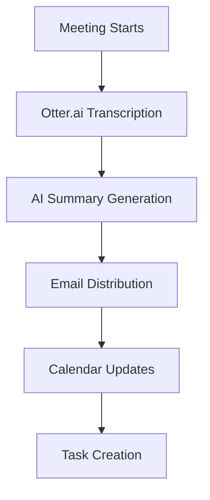
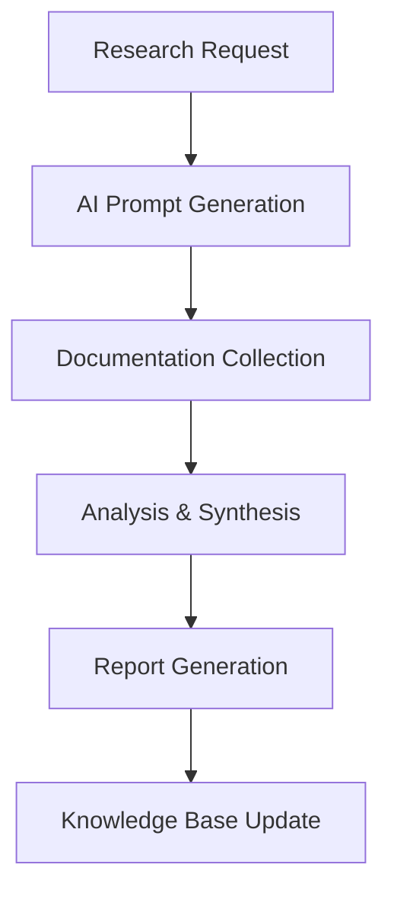
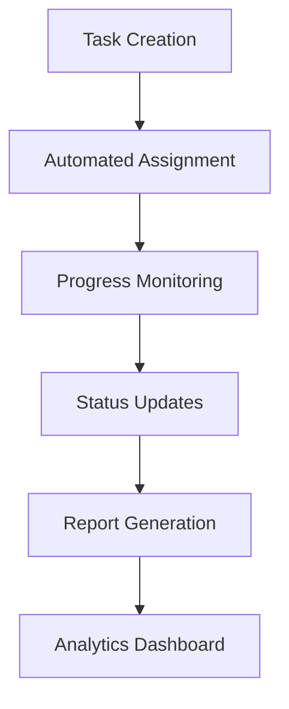

# Core Work Methodology - Execution Plan

## 1. Independent Work Process Implementation

### 1.1 Planning Phase Setup
- [ ] Meeting Management System
  - Set up Otter.ai for automated meeting transcription
  - Configure Gmail templates for meeting summaries
  - Implement Google Calendar API integration for automated reminders
  - Create standardized meeting summary template

#### Automation Tools:
- Otter.ai for transcription
- Gmail API for automated emails
- Google Calendar API for reminders
- n8n for workflow automation

#### AI Assistance:
- Claude for meeting summary refinement
- GPT-4 for action item extraction
- Anthropic Claude for documentation formatting

### 1.2 Research Phase Implementation
- [ ] AI Prompt Management
  - Create prompt library in notion
  - Implement version control for prompts
  - Set up prompt testing workflow
  - Document prompt effectiveness metrics

#### Tools:
- Notion for prompt library
- GitHub for version control
- Airtable for metrics tracking
- Zapier for automation

#### AI Systems:
- Claude for prompt generation
- GPT-4 for prompt testing
- Anthropic Claude for documentation analysis

### 1.3 Execution Phase Structure
- [ ] Progress Tracking System
  - Implement Jira project templates
  - Set up automated status reporting
  - Create milestone tracking dashboard
  - Configure notification system

#### Tools:
- Jira for project management
- Tableau for analytics
- Slack for notifications
- GitHub for code management

#### AI Integration:
- Claude for progress analysis
- GPT-4 for status report generation
- GitHub Copilot for code assistance

## 2. Tools Integration Setup

### 2.1 AI Assistants Configuration
- [ ] Setup Tasks
  - Configure API access for all AI services
  - Create role-based access controls
  - Implement usage tracking
  - Set up cost monitoring

### 2.2 Cursor IDE Integration
- [ ] Development Environment
  - Create standardized workspace configs
  - Set up team snippets library
  - Configure auto-formatting rules
  - Implement code review automation

### 2.3 Dropbox Organization
- [ ] File Structure
  - Create standardized folder hierarchy
  - Implement naming conventions
  - Set up automated backup system
  - Configure version control integration

### 2.4 Task Management Integration
- [ ] System Setup
  - Configure Jira-Discord integration
  - Set up automated task creation
  - Implement priority management
  - Create reporting dashboards

### 2.5 Discord Workspace
- [ ] Channel Structure
  - Create department-specific channels
  - Set up role-based permissions
  - Configure bot integrations
  - Implement notification rules

## Checklists

### Daily Operations
- [ ] Morning meeting summary generation
- [ ] Task prioritization review
- [ ] Progress update collection
- [ ] Documentation update
- [ ] End-of-day reporting

### Weekly Operations
- [ ] Tool performance review
- [ ] AI system usage analysis
- [ ] Documentation audit
- [ ] Process optimization review
- [ ] Team feedback collection

### Monthly Operations
- [ ] System integration review
- [ ] Automation efficiency analysis
- [ ] Process documentation update
- [ ] Tool stack evaluation
- [ ] Performance metrics review

## Automation Workflow

1. Meeting Management

2. Research Process

3. Execution Tracking

## Implementation Notes

1. All systems should be implemented with fail-safes and redundancy
2. Regular backup procedures must be established
3. Documentation should be automatically versioned
4. Access controls must be role-based
5. Monitoring systems should include alerting mechanisms 