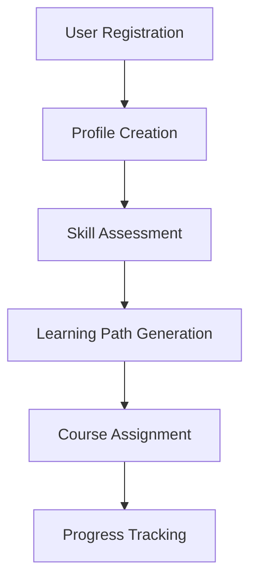
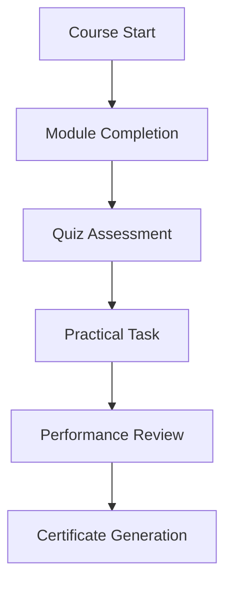
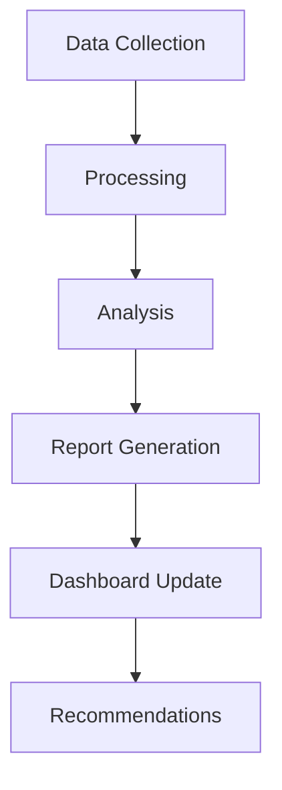

# Onboarding System Implementation - Execution Plan

## 1. Learning Materials Development

### 1.1 Content Creation System
- [ ] Learning Course Structure
  - Design course templates
  - Create milestone tracking system
  - Implement progress validation
  - Set up completion certificates

#### Tools:
- Notion for course management
- Moodle for learning platform
- Airtable for progress tracking
- Canva for certificate design

#### AI Integration:
- Claude for content generation
- GPT-4 for quiz creation
- Anthropic Claude for content validation

### 1.2 FlashCard System
- [ ] Implementation Tasks
  - Set up Anki integration
  - Create card templates
  - Implement spaced repetition
  - Design review tracking

#### Tools:
- Anki for flashcards
- Notion for content management
- Zapier for automation
- Airtable for analytics

### 1.3 Quiz System
- [ ] Development Tasks
  - Create question bank
  - Implement scoring system
  - Set up difficulty scaling
  - Design feedback mechanism

#### Tools:
- Typeform for quizzes
- MongoDB for question bank
- Tableau for analytics
- Discord for notifications

### 1.4 Practical Test Tasks
- [ ] Setup Requirements
  - Create task templates
  - Implement evaluation criteria
  - Set up automated testing
  - Design feedback system

## 2. Technical Infrastructure

### 2.1 Database Implementation
- [ ] Setup Tasks
  - Design schema structure
  - Implement MongoDB setup
  - Create backup system
  - Configure monitoring

#### Database Schema:
```json
{
  "user": {
    "id": "string",
    "name": "string",
    "progress": {
      "courses": ["courseId"],
      "quizzes": ["quizId"],
      "tasks": ["taskId"]
    },
    "performance": {
      "scores": ["number"],
      "completion": ["percentage"]
    }
  }
}
```

### 2.2 CRM Integration
- [ ] Implementation Steps
  - Configure API connections
  - Set up data sync
  - Implement tracking
  - Create reporting system

### 2.3 Frontend Development
- [ ] UI/UX Tasks
  - Design component library
  - Implement responsive layout
  - Create interactive elements
  - Set up analytics

#### Tech Stack:
- React for frontend
- TailwindCSS for styling
- Next.js for framework
- Vercel for deployment

## 3. Media Production

### 3.1 Landing Page
- [ ] Development Tasks
  - Design wireframes
  - Create components
  - Implement gamification
  - Set up analytics

#### Design Elements:
- Hero section
- Course catalog
- Progress tracking
- Achievement system

### 3.2 Visual Content
- [ ] Production Tasks
  - Design mascot character
  - Create comic templates
  - Produce video content
  - Design learning aids

#### Tools:
- Figma for design
- Adobe Creative Suite
- Canva for templates
- DaVinci Resolve for video

## Checklists

### Daily Operations
- [ ] Content updates
- [ ] Progress monitoring
- [ ] User support
- [ ] System health check
- [ ] Analytics review

### Weekly Operations
- [ ] Content quality review
- [ ] Performance analysis
- [ ] User feedback review
- [ ] System optimization
- [ ] Report generation

### Monthly Operations
- [ ] Content audit
- [ ] System maintenance
- [ ] Performance review
- [ ] Strategy adjustment
- [ ] Documentation update

## Automation Workflow

1. User Onboarding


2. Learning Progress


3. Analytics System


## Implementation Notes

1. System Requirements
   - High availability (99.9% uptime)
   - Scalable architecture
   - Real-time analytics
   - Automated backups
   - Security compliance

2. Performance Metrics
   - User engagement rates
   - Completion percentages
   - Assessment scores
   - Time-to-completion
   - User satisfaction

3. Security Measures
   - Role-based access
   - Data encryption
   - Regular audits
   - Compliance checks
   - Incident response plan 