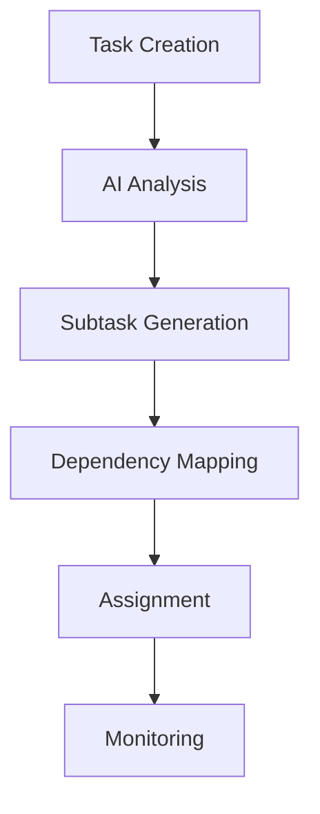
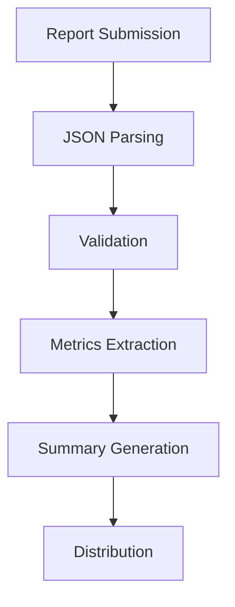
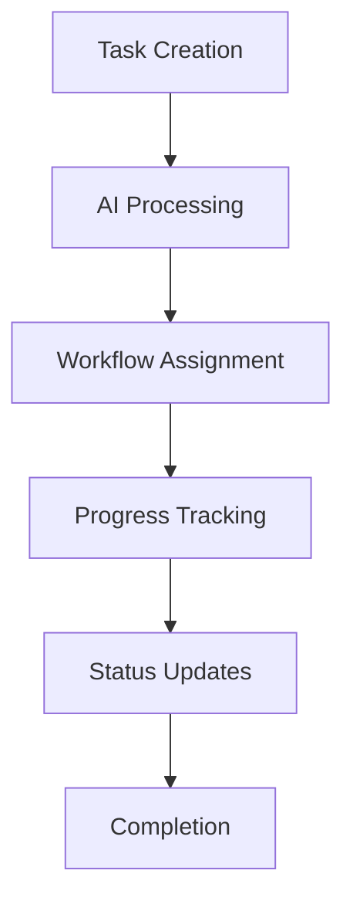
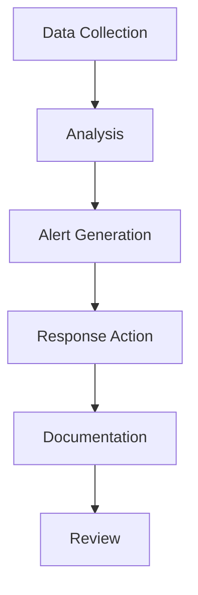

# Automation Systems - Execution Plan

## 1. Discord Integration System

### 1.1 Monitoring System Setup
- [ ] Channel Configuration
  - Set up department channels
  - Configure monitoring rules
  - Implement validation system
  - Create alert system

#### Tools:
- Discord.js for bot development
- MongoDB for data storage
- n8n for workflow automation
- Grafana for monitoring

#### Bot Features:
```javascript
{
  "monitoring": {
    "channels": ["department-specific"],
    "metrics": ["activity", "reports", "engagement"],
    "alerts": ["validation-fails", "deadlines", "updates"]
  }
}
```

### 1.2 Report Processing System
- [ ] Implementation Tasks
  - Create JSON parsers
  - Set up validation rules
  - Implement metrics extraction
  - Configure summary generation

#### Workflow Components:
- JSON Schema validation
- Field extraction rules
- Metrics calculation
- Report templating

### 1.3 Implementation Schedule
- [ ] Phase 1: Basic Setup
  - Bot deployment
  - Channel configuration
  - Basic monitoring
  - Simple reporting

- [ ] Phase 2: Advanced Features
  - Complex validation
  - Metrics dashboard
  - Automated responses
  - Integration testing

## 2. Task Management Automation

### 2.1 AI Integration
- [ ] Setup Requirements
  - Configure AI endpoints
  - Implement prompt system
  - Set up task analysis
  - Create response handling

#### AI Components:
- Claude for task analysis
- GPT-4 for subtask generation
- Anthropic Claude for validation

### 2.2 Task Flow System
- [ ] Implementation Steps
  - Design workflow rules
  - Create dependency tracking
  - Implement status updates
  - Set up notifications

#### System Architecture:


### 2.3 Progress Tracking
- [ ] Development Tasks
  - Create metrics system
  - Implement dashboards
  - Set up reporting
  - Configure alerts

#### Tracking Components:
- Real-time progress monitoring
- Performance metrics
- Time tracking
- Resource utilization

## Checklists

### Daily Operations
- [ ] Bot health check
- [ ] Report validation
- [ ] Metrics collection
- [ ] Alert monitoring
- [ ] System backup

### Weekly Operations
- [ ] Performance analysis
- [ ] System optimization
- [ ] Report generation
- [ ] User feedback review
- [ ] Documentation update

### Monthly Operations
- [ ] System audit
- [ ] Feature assessment
- [ ] Capacity planning
- [ ] Security review
- [ ] Backup verification

## Automation Workflows

1. Report Processing


2. Task Management


3. Monitoring System


## Implementation Notes

### 1. System Requirements
- High availability (99.9%)
- Real-time processing
- Scalable architecture
- Fault tolerance
- Data redundancy

### 2. Security Measures
- Role-based access
- Data encryption
- Audit logging
- Regular backups
- Incident response

### 3. Performance Metrics
- Response time
- Processing speed
- Error rates
- System utilization
- User satisfaction

### 4. Integration Points
- Discord API
- AI Services
- Database Systems
- Monitoring Tools
- Reporting Systems

### 5. Maintenance Procedures
- Regular updates
- Performance tuning
- Security patches
- Backup verification
- Documentation updates

## Error Handling

### 1. Discord Bot
```javascript
{
  "error_handling": {
    "connection_loss": "reconnect_strategy",
    "rate_limiting": "queue_system",
    "api_errors": "retry_mechanism",
    "validation_fails": "notification_system"
  }
}
```

### 2. Task Management
```javascript
{
  "error_recovery": {
    "task_failure": "rollback_procedure",
    "data_corruption": "recovery_process",
    "system_overload": "load_balancing",
    "dependency_issues": "resolution_workflow"
  }
}
```

## Deployment Strategy

### 1. Initial Deployment
- Development environment setup
- Testing environment configuration
- Staging environment validation
- Production deployment plan

### 2. Rollout Phases
- Phase 1: Basic functionality
- Phase 2: Advanced features
- Phase 3: Integration completion
- Phase 4: Performance optimization

### 3. Monitoring Plan
- System health metrics
- Performance indicators
- User engagement tracking
- Error rate monitoring
- Resource utilization 