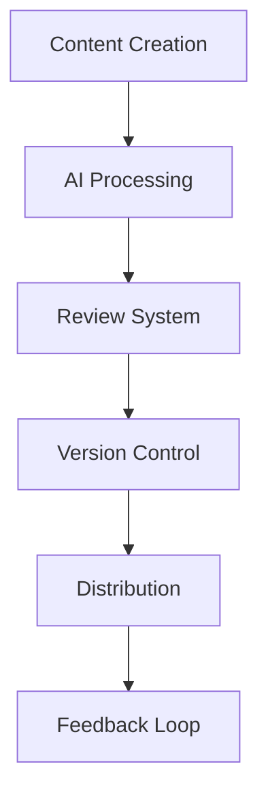
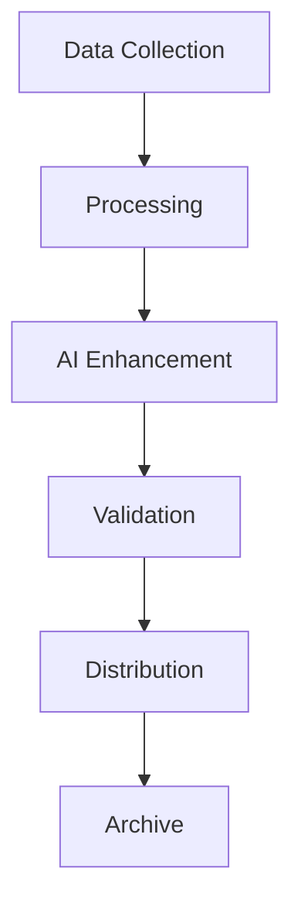
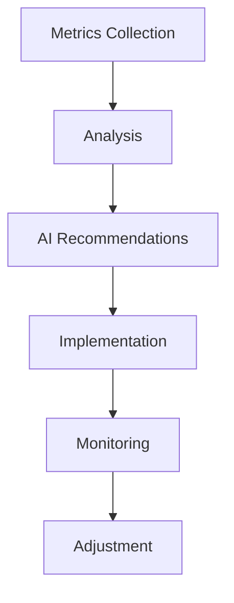

# Documentation and Reporting - Execution Plan

## 1. Standard Documentation System

### 1.1 Daily Reports Framework
- [ ] Setup Requirements
  - Create report templates
  - Implement automated collection
  - Set up validation system
  - Configure distribution

#### Report Structure:
```json
{
  "daily_report": {
    "recruiter_activity": {
      "interviews_conducted": "number",
      "candidates_processed": "number",
      "positions_filled": "number"
    },
    "progress_metrics": {
      "goals_achieved": ["string"],
      "ongoing_tasks": ["string"],
      "blockers": ["string"]
    },
    "details": {
      "specific_points": ["string"],
      "action_items": ["string"],
      "notes": ["string"]
    }
  }
}
```

### 1.2 Company Structure Documentation
- [ ] Implementation Tasks
  - Create department templates
  - Define role descriptions
  - Document workflows
  - Set up maintenance system

#### Documentation Components:
- Organizational charts
- Role definitions
- Process flows
- Responsibility matrices

## 2. AI Integration System

### 2.1 Prompt Library Development
- [ ] Setup Requirements
  - Create prompt categories
  - Implement version control
  - Set up testing system
  - Configure deployment

#### Prompt Structure:
```json
{
  "prompt_template": {
    "category": "string",
    "purpose": "string",
    "context": "string",
    "variables": ["string"],
    "examples": ["string"],
    "validation_rules": ["string"]
  }
}
```

### 2.2 Documentation Generation
- [ ] Implementation Tasks
  - Set up AI endpoints
  - Create templates
  - Implement review system
  - Configure version control

#### AI Tools:
- Claude for content generation
- GPT-4 for technical writing
- Anthropic Claude for review

### 2.3 Process Optimization
- [ ] Development Tasks
  - Create analysis system
  - Implement metrics tracking
  - Set up feedback loop
  - Configure reporting

## Checklists

### Daily Operations
- [ ] Report generation
- [ ] Documentation review
- [ ] AI prompt testing
- [ ] Metrics collection
- [ ] System backup

### Weekly Operations
- [ ] Content audit
- [ ] Performance review
- [ ] System optimization
- [ ] Documentation update
- [ ] Feedback analysis

### Monthly Operations
- [ ] System evaluation
- [ ] Process refinement
- [ ] Documentation overhaul
- [ ] Strategy adjustment
- [ ] Compliance check

## Automation Workflows

1. Documentation Process


2. Reporting System


3. Process Optimization


## Implementation Notes

### 1. System Architecture
- Microservices based
- Event-driven
- Cloud-native
- API-first design
- Scalable infrastructure

### 2. Integration Points
- AI Services
  - OpenAI API
  - Anthropic API
  - Custom Models
- Storage Systems
  - Document DB
  - File Storage
  - Version Control
- Communication
  - Email Service
  - Chat Systems
  - Notification Service

### 3. Security Requirements
- Role-based access
- Data encryption
- Audit logging
- Compliance tracking
- Backup systems

## Documentation Standards

### 1. Technical Documentation
```markdown
# Component Name

## Overview
[Brief description]

## Implementation
- Key features
- Dependencies
- Configuration

## Usage
- Examples
- Best practices
- Common issues

## Maintenance
- Update procedures
- Troubleshooting
- Contact information
```

### 2. Process Documentation
```markdown
# Process Name

## Purpose
[Process objective]

## Steps
1. Step description
2. Required inputs
3. Expected outputs

## Roles
- Responsibilities
- Permissions
- Escalation paths

## Metrics
- KPIs
- Success criteria
- Monitoring points
```

## Quality Control

### 1. Documentation Review
- [ ] Technical accuracy
- [ ] Completeness
- [ ] Clarity
- [ ] Consistency
- [ ] Up-to-date status

### 2. Report Validation
- [ ] Data accuracy
- [ ] Format compliance
- [ ] Completeness
- [ ] Timeliness
- [ ] Distribution status

### 3. AI Output Verification
- [ ] Content quality
- [ ] Accuracy
- [ ] Relevance
- [ ] Consistency
- [ ] Compliance

## Maintenance Procedures

### 1. Regular Updates
- Daily report templates
- Documentation systems
- AI prompts
- Process workflows
- Security protocols

### 2. Version Control
- Documentation versioning
- Template management
- Process documentation
- AI prompt versions
- System configurations

### 3. Backup Procedures
- Documentation backup
- Report archives
- System configurations
- AI prompt library
- Process documentation 