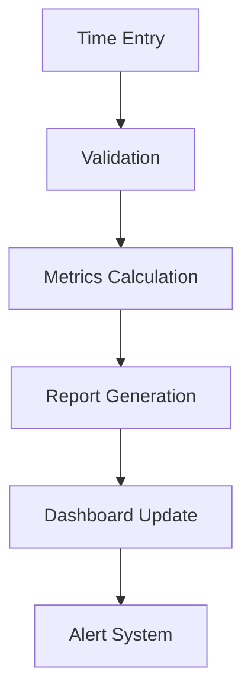
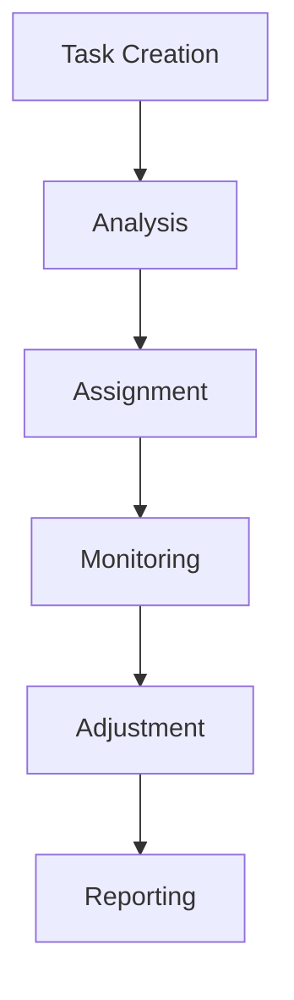
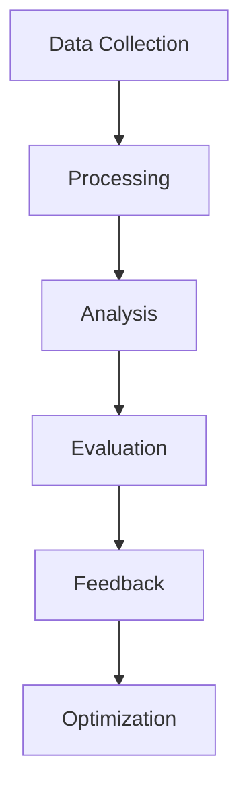

# Quality Control and Monitoring - Execution Plan

## 1. Workload Management System

### 1.1 Time Tracking Implementation
- [ ] Setup Requirements
  - Configure tracking system
  - Implement metrics collection
  - Set up reporting
  - Create dashboards

#### Time Tracking Schema:
```json
{
  "time_entry": {
    "user_id": "string",
    "task_id": "string",
    "start_time": "datetime",
    "end_time": "datetime",
    "category": "string",
    "notes": "string",
    "metrics": {
      "efficiency": "number",
      "quality_score": "number",
      "completion_rate": "number"
    }
  }
}
```

### 1.2 Task Distribution System
- [ ] Implementation Tasks
  - Create assignment algorithm
  - Implement load balancing
  - Set up priority system
  - Configure monitoring

#### Distribution Rules:
- Skill-based routing
- Workload balancing
- Priority handling
- Deadline management

## 2. Performance Monitoring

### 2.1 Employee Progress Tracking
- [ ] Development Tasks
  - Create metrics system
  - Implement dashboards
  - Set up reporting
  - Configure alerts

#### Tracking Metrics:
```json
{
  "employee_metrics": {
    "skill_progress": {
      "current_level": "number",
      "target_level": "number",
      "completion_rate": "number"
    },
    "task_metrics": {
      "completed": "number",
      "in_progress": "number",
      "quality_score": "number"
    },
    "learning_metrics": {
      "courses_completed": "number",
      "certifications": ["string"],
      "assessment_scores": ["number"]
    }
  }
}
```

### 2.2 System Effectiveness
- [ ] Implementation Tasks
  - Create evaluation metrics
  - Implement feedback system
  - Set up optimization
  - Configure reporting

## Checklists

### Daily Operations
- [ ] Time tracking review
- [ ] Task distribution check
- [ ] Performance monitoring
- [ ] System health check
- [ ] Alert handling

### Weekly Operations
- [ ] Workload analysis
- [ ] Performance review
- [ ] System optimization
- [ ] Report generation
- [ ] Team feedback

### Monthly Operations
- [ ] System evaluation
- [ ] Process refinement
- [ ] Documentation update
- [ ] Strategy adjustment
- [ ] Compliance check

## Automation Workflows

1. Time Tracking Process


2. Task Distribution


3. Performance Monitoring


## Implementation Notes

### 1. System Architecture
- Microservices based
- Real-time monitoring
- Scalable analytics
- API-driven
- Cloud-native

### 2. Integration Points
- Time Tracking System
- Task Management
- Performance Analytics
- Reporting Tools
- Alert System

### 3. Quality Metrics
- Task completion rate
- Quality scores
- Efficiency metrics
- Learning progress
- System performance

## Monitoring Systems

### 1. Real-time Monitoring
```json
{
  "monitoring_config": {
    "metrics": {
      "system_health": ["cpu", "memory", "network"],
      "user_activity": ["active_users", "task_completion", "errors"],
      "performance": ["response_time", "throughput", "error_rate"]
    },
    "alerts": {
      "thresholds": {
        "critical": "number",
        "warning": "number",
        "info": "number"
      },
      "notifications": {
        "email": "boolean",
        "slack": "boolean",
        "dashboard": "boolean"
      }
    }
  }
}
```

### 2. Analytics Dashboard
- Real-time metrics
- Historical trends
- Performance indicators
- System health
- Alert status

### 3. Reporting System
- Daily summaries
- Weekly analysis
- Monthly reports
- Custom reports
- Trend analysis

## Quality Control Procedures

### 1. Task Quality
- [ ] Review process
- [ ] Quality metrics
- [ ] Feedback system
- [ ] Improvement tracking
- [ ] Documentation

### 2. System Quality
- [ ] Performance monitoring
- [ ] Error tracking
- [ ] User feedback
- [ ] System optimization
- [ ] Documentation

### 3. Process Quality
- [ ] Workflow review
- [ ] Efficiency metrics
- [ ] Optimization plans
- [ ] Implementation tracking
- [ ] Documentation

## Maintenance Procedures

### 1. System Updates
- Regular maintenance
- Performance optimization
- Security updates
- Feature updates
- Documentation updates

### 2. Data Management
- Backup procedures
- Data cleanup
- Archive management
- Recovery testing
- Documentation

### 3. Process Updates
- Workflow optimization
- Rule updates
- Integration maintenance
- System tuning
- Documentation

## Security Measures

### 1. Access Control
- Role-based access
- Authentication system
- Authorization rules
- Audit logging
- Security monitoring

### 2. Data Protection
- Encryption standards
- Backup procedures
- Access controls
- Compliance requirements
- Security protocols

### 3. Compliance
- Regular audits
- Policy enforcement
- Documentation
- Training
- Updates 