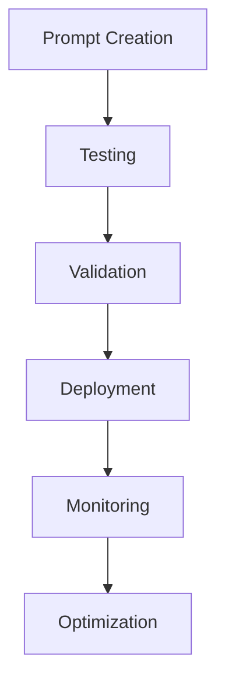
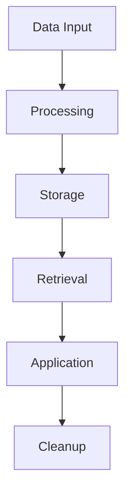
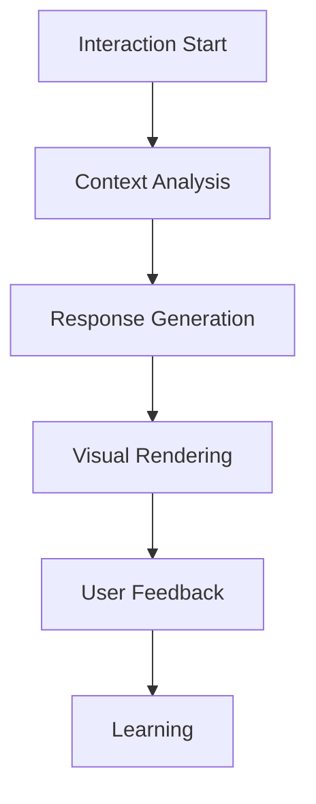

# LLM Integration and AI Systems - Execution Plan

## 1. Prompt Engineering System

### 1.1 Best Practices Implementation
- [ ] Development Tasks
  - Create prompt templates
  - Implement testing framework
  - Set up version control
  - Configure deployment system

#### Prompt Structure:
```json
{
  "prompt_template": {
    "name": "string",
    "version": "string",
    "category": "string",
    "components": {
      "context": "string",
      "instruction": "string",
      "examples": ["string"],
      "constraints": ["string"]
    },
    "metadata": {
      "author": "string",
      "created_date": "datetime",
      "last_modified": "datetime",
      "performance_metrics": {
        "success_rate": "number",
        "average_tokens": "number",
        "cost_per_use": "number"
      }
    }
  }
}
```

### 1.2 Memory Techniques Integration
- [ ] Implementation Tasks
  - Design memory system
  - Implement context management
  - Create retrieval system
  - Set up optimization

#### Memory System:
```json
{
  "memory_config": {
    "storage_type": "string",
    "retention_policy": {
      "max_tokens": "number",
      "time_window": "duration",
      "priority_rules": ["string"]
    },
    "retrieval_strategy": {
      "method": "string",
      "relevance_threshold": "number",
      "context_window": "number"
    }
  }
}
```

### 1.3 Visual Integration
- [ ] Setup Requirements
  - Create visual templates
  - Implement style guides
  - Set up asset management
  - Configure rendering system

## 2. Mascot System Implementation

### 2.1 Character Development
- [ ] Development Tasks
  - Create character design
  - Implement personality
  - Set up interaction system
  - Configure responses

#### Character Schema:
```json
{
  "mascot": {
    "name": "string",
    "personality_traits": ["string"],
    "visual_attributes": {
      "style": "string",
      "colors": ["string"],
      "expressions": ["string"]
    },
    "interaction_rules": {
      "tone": "string",
      "response_patterns": ["string"],
      "context_awareness": ["string"]
    }
  }
}
```

### 2.2 Environmental System
- [ ] Implementation Tasks
  - Create object library
  - Implement constraints
  - Set up interaction rules
  - Configure scene management

#### Environment Config:
```json
{
  "environment": {
    "objects": {
      "max_count": 30,
      "categories": ["string"],
      "interaction_rules": ["string"]
    },
    "scenes": {
      "templates": ["string"],
      "transitions": ["string"],
      "states": ["string"]
    }
  }
}
```

## 3. LLM JSON Structure

### 3.1 File Organization
- [ ] Setup Requirements
  - Create file hierarchy
  - Implement versioning
  - Set up documentation
  - Configure integration

#### File Structure:
```json
{
  "llm_library": {
    "categories": {
      "prompts": {
        "path": "string",
        "versions": ["string"],
        "metadata": {}
      },
      "responses": {
        "path": "string",
        "processing_rules": ["string"],
        "storage_policy": {}
      },
      "analytics": {
        "path": "string",
        "metrics": ["string"],
        "reporting": {}
      }
    }
  }
}
```

### 3.2 Integration System
- [ ] Implementation Tasks
  - Create API endpoints
  - Implement handlers
  - Set up monitoring
  - Configure logging

## Checklists

### Daily Operations
- [ ] Prompt performance review
- [ ] Memory system check
- [ ] Mascot interaction audit
- [ ] System monitoring
- [ ] Error handling

### Weekly Operations
- [ ] Performance analysis
- [ ] Content updates
- [ ] System optimization
- [ ] Documentation review
- [ ] Backup verification

### Monthly Operations
- [ ] System evaluation
- [ ] Strategy adjustment
- [ ] Content overhaul
- [ ] Performance tuning
- [ ] Compliance check

## Automation Workflows

1. Prompt Management


2. Memory System


3. Mascot Integration


## Implementation Notes

### 1. System Architecture
- Microservices based
- Event-driven
- API-first design
- Scalable infrastructure
- Real-time processing

### 2. Integration Points
- LLM APIs
  - OpenAI
  - Anthropic
  - Custom Models
- Storage Systems
  - Vector Database
  - Document Store
  - Cache Layer
- Processing Systems
  - Queue Management
  - Event Processing
  - Real-time Analytics

### 3. Performance Requirements
- Response time < 1s
- 99.9% uptime
- Error rate < 0.1%
- Memory efficiency
- Cost optimization

## Monitoring and Analytics

### 1. System Metrics
```json
{
  "metrics_config": {
    "performance": {
      "response_time": "milliseconds",
      "throughput": "requests/second",
      "error_rate": "percentage"
    },
    "usage": {
      "token_consumption": "number",
      "api_calls": "number",
      "cost": "currency"
    },
    "quality": {
      "accuracy": "percentage",
      "relevance": "score",
      "user_satisfaction": "rating"
    }
  }
}
```

### 2. Reporting System
- Real-time dashboards
- Daily summaries
- Weekly analysis
- Monthly reports
- Cost tracking

### 3. Alert System
- Performance thresholds
- Error conditions
- Usage limits
- Cost controls
- System health

## Security Measures

### 1. Data Protection
- Encryption standards
- Access controls
- Audit logging
- Compliance requirements
- Privacy protection

### 2. API Security
- Authentication
- Rate limiting
- Request validation
- Response sanitization
- Error handling

### 3. Compliance
- Data retention
- Privacy policies
- Usage tracking
- Documentation
- Regular audits 